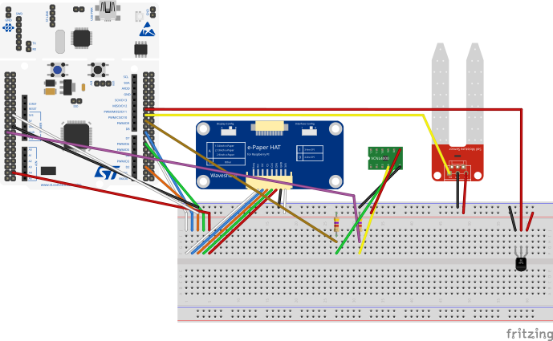
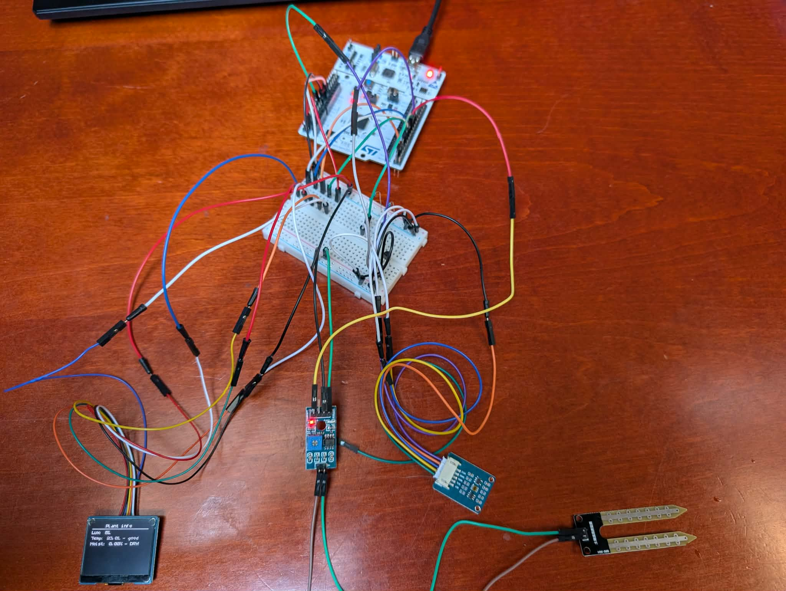

# Rubber Plant Rescue Panel
This project showcases the use of STM32 Nucleo MCU, couple of sensors and a small grayscale OLED display
to monitor potted-plant's parameters(altough I made this specifically for my rubber plant
since it just keeps dying and I have no idea what's going on.).
This was made only for learning purposes, since I want to learn embedded and STM32.

MCU used: STMF446RE

This repository features drivers for two core external peripherals:
- Waveshare 24777 1.32in OLED Display Module with SPI communication
- Waveshare TSL25911 ambient light intensity sensor with I2C communication

I also used two analog sensors, TMP36 for temperature and MOD-01588 for soil
moisutre measurment, which are sampled by integrated ADC.

## STM32 Capabilities used
Since the sole purpose of this project is learning, here I will list mechanisms of
the MCU used:
- ADC for converting analog signal of temperature and moist sensors
- In the ADC conversion I decided to use DMA single scan mode, which
runs at 10Hz(along with screen refresh)
- SPI communication with display
- GPIO output to control display communication
- I2C communication with light sensor

For all aforementioned mechanisms I've used HAL.

## Connections schema

## Example of connected system

## Running

Compile and run like you would any other STM32 Nucleo project.

## Customization
If you wish to try this prototype on your own potted plant, make sure to change
warning thresholds in `plant_characteristics.h` file!